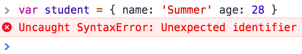

# Javascript Skills Assessment

This assessment helps determine which topics need to be reviewed in the upcoming course and is *not* an evaluation of your previous performance.  If you do not know the answer to a question, please do not try to research the answer, just leave it blank.  Guessing on a question or researching the answer can skew the results that help us identify what materials to cover.

## Primitive Types

<!-- Question -->
### !challenge
* type: code-snippet
* language: javascript
* id: c310d502-9c87-4e42-a989-686e0cf5f465
* title: Primitive Types Checkpoint B
* standard_uuids: WD-DgkEAAUBDwM
* topics: JavaScript
### !question
Assign the variables to values so that the following statements evaluate as described:

```js
// Expression A
(x + y) > z || a == b || ((l || m) && n) // resolves to true

// Expression B
!!n && (x + y + z) && a // resolves to false

// Expression C
m[n].length + n === 1 // resolves to true
```
### !end-question
### !placeholder
```js
var a;
var b;
var l;
var m;
var n;
var x;
var y;
var z;
```
### !end-placeholder
### !tests

```js
describe('Complex Comparisons', function () {
  describe('Expression A', function () {
    it('should resolve to true', function () {
      const actual = ((x + y) > z || a == b || ((l || m) && n))
      expect(actual, 'Expression A is currently false!').to.be.ok
    })

    it('should resolve to false', function () {
      const actual = (!!n && (x + y + z) && a)
      expect(actual, 'Expression B is currently false!').to.not.be.ok
    })

    it('should resolve to true', function () {
      const actual = (m[n].length + n === 1)
      expect(actual, 'Expression C is currently false!').to.be.ok
    })
  })
})
```
### !end-tests
### !end-challenge

## Data Structures

### !challenge
* type: code-snippet
* language: javascript
* id: 68023D2D-9BED-4BA1-965F-C133EA2989FB
* title: Data Structures Checkpoint
* standard_uuids: WD-Aw0MCQwHCgs
* topics: JavaScript
### !question
Your friends are ordering some food.  Given the foods, people, and orders
arrays, use native array methods to fully populate the orders array.

To start you off, we've shown you how to record Milly is ordering pizza, and ice cream.

*Note* the order property should always be an array, even if the person is ordering one thing.

Add the following orders - in this order - to the orders array

1. George orders sushi
1. Sally orders steak and sushi
1. Ken orders steak and ice cream
### !end-question
### !placeholder
```js
var foods = ['pizza', 'sushi', 'steak', 'ice cream']
var people = ['Milly', 'George', 'Sally', 'Ken']
var orders = []

orders.push({ name: people[0], order: [foods[0], foods[3]] })
```
### !end-placeholder
### !tests
```js
describe('orders array', function() {

  it('has Milly\'s order', function() {
    expect(orders[0]).to.eql({ name: 'Milly', order: ['pizza', 'ice cream'] })
  })

  it('has George\'s order', function() {
    expect(orders[1]).to.eql({ name: 'George', order: ['sushi'] })
  })

  it('has Sally\'s order', function() {
    expect(orders[2]).to.eql({ name: 'Sally', order: ['steak', 'sushi'] })
  })

  it('has Ken\'s order', function() {
    expect(orders[3]).to.eql({ name: 'Ken', order: ['steak', 'ice cream'] })
  })

  it('has all of the correct orders', function() {
    expect(orders).to.eql([
      { name: 'Milly', order: ['pizza', 'ice cream'] },
      { name: 'George', order: ['sushi'] },
      { name: 'Sally', order: ['steak', 'sushi'] },
      { name: 'Ken', order: ['steak', 'ice cream'] }
    ])
  })

})
```

### !end-tests

### !end-challenge

## Iterations and Conditionals

<!--BEGIN CHALLENGE-->
### !challenge
* type: code-snippet
* language: javascript
* id: 233483f6-980b-4f1f-9cef-78d2ee93c3ea
* title: Complete the steps
* topics: JavaScript
### !question
Complete all of the steps in the comments of this code:
### !end-question
### !setup
### !end-setup
### !placeholder
```js
function question0 (array) {
  // Write a for loop that will print only even numbers from an array:
  // For example: question0([ 5, 20, 11, 42, 2, 19 ]) >> [ 20, 42, 2 ]
}

function question1 (array) {
  // Write a for loop that doubles each number in the following array. If the
  // resulting number is greater than 12, print it to the console:
  // For example: [ 2, 4, 8, 16 ] would print the numbers 16 and 32
}

function question2 (array) {
  // Write a for loop to iterate over every element in the following array:
  // [ 'Mon', 'Tues', 'Wed', 'Thurs', 'Fri', 'Sat', 'Sun' ]
  //
  // Using a switch statement, do the following:
  // - If the day is on a weekend, print "Yay, it's the weekend!"
  // - If the day is Friday, print "Almost there..."
  // - If the day is Monday, print "I hate Mondays more than Garfield."
  // - Otherwise, print "Everybody's working for the weekend."
}
```
### !end-placeholder
### !tests
```js
const assert = chai.assert;
var sinon = require('mocha-sinon');

function stubFn() { this.sinon.stub(console, 'log') }

describe('Test results', () => {

  beforeEach(stubFn);

  it('question0', () => {
    var input = [ 5, 20, 11, 42, 2, 19 ];
    var expected = [ 20, 42, 2 ];
    question0(input);

    assert.equal(console.log.callCount, expected.length, "console.log not called the correct number of times.");
    expected.forEach(num => assert.isTrue(console.log.calledWith(num)), "Values not properly passed to console.log.");
  })

  it('question1', () => {
    const input = [ 2, 4, 8, 16 ];
    const expected = [ 16, 32 ];
    question1(input)

    assert.equal(console.log.callCount, expected.length, "console.log not called the correct number of times.");
    expected.forEach(num => assert.isTrue(console.log.calledWith(num)), "Values not properly passed to console.log.");
  })

  it('question2', () => {
    const input = [ 'Mon', 'Tues', 'Wed', 'Thurs', 'Fri', 'Sat', 'Sun' ];
    question2(input);

    assert.equal(console.log.callCount, input.length, "console.log not called the correct number of times.");
    assert.isTrue(console.log.calledWith('I hate Mondays more than Garfield.'), "Incorrect value printed.");
    assert.isTrue(console.log.calledWith('Everybody\'s working for the weekend.'), "Incorrect value printed.");
    assert.isTrue(console.log.calledWith('Almost there...'), "Incorrect value printed.");
    assert.isTrue(console.log.calledWith('Yay, it\'s the weekend!'), "Incorrect value printed.");
  })
})

```
### !end-tests
### !explanation
### !end-explanation
### !end-challenge
<!--END CHALLENGE-->

## Functions

### !challenge
* type: code-snippet
* language: javascript
* id: BB49300F-B507-4CC5-B1A4-C8D40283A1E7
* title: Functions Checkpoint A
* standard_uuids: WD-CAYKDAkEDQ4
* topics: JavaScript
### !question
Strings are intense if they end in three or more more ! marks.
However, having ! marks anywhere but the end makes for a non-intense
string

Intense Strings
* Hello!!!
* This is an intense string!!!!

Non-intense strings
* Hello
* This is ! not an intense string!!!!
* Also not intense!!

Implement the intenseString function below, where it will return true
when an intense string is passed in, and false otherwise.
### !end-question
### !placeholder
```js
function intenseString(str) {
  // your code here
}
```
### !end-placeholder
### !tests
```js
describe('intenseString', function() {

    it("can detect intense strings", function() {
      expect(intenseString('Hello!!!')).to.equal(true)
      expect(intenseString('Intense strings!!!!!')).to.equal(true)
    })
    it("can detect non-intense strings", function() {
      expect(intenseString('')).to.equal(false)
      expect(intenseString('Intense strings!')).to.equal(false)
      expect(intenseString('Intense strings!!')).to.equal(false)
      expect(intenseString('!Intense! strings!!!')).to.equal(false)
    })

})
```
### !end-tests
### !end-challenge

<!-- Question -->

### !challenge
* type: code-snippet
* language: javascript
* id: 69803030-E0EF-46AF-B064-B2D25B81F83D
* title: Functions Checkpoint Mean
* standard_uuids: WD-CAYKDAkEDQ4
* topics: JavaScript
### !question
Implement the functions below for [mean](https://www.khanacademy.org/math/statistics-probability/summarizing-quantitative-data/mean-median-basics/a/mean-median-and-mode-review).
### !end-question
### !placeholder
```js
function mean(numbers) {
  // your code here
}
```
### !end-placeholder
### !tests
```js
describe('mean function', function() {

    it("can compute the mean", function() {
      expect(mean([10, 10, 15, 20, 20])).to.equal(15)
    })

})
```
### !end-tests
### !end-challenge

## Debugging

### !challenge
* type: multiple-choice
* id: c703daca-2b8b-49cd-b6af-f2efa771fc5f
* title: Syntax Errors
* topics: JavaScript
##### !question
Take a look at the following error. Choose the option below that would fix the error.


##### !end-question
##### !options
* `var student = { 'name': 'Summer' 'age': 28 }`
* `var student === { name: 'Summer' age: 28 }`
* `var student = { name: 'Summer', age: 28 }`
* `var student === { name: 'Summer', age: 28 }`
##### !end-options
##### !answer
`var student = { name: 'Summer', age: 28 }`
##### !end-answer
### !end-challenge

### !challenge
* type: code-snippet
* language: javascript
* id: 1a03a7b3-0065-490a-8b74-9f9d36a5247c
* title: Wolf Fencing
* topics: JavaScript
### !question

The following code has a couple of bugs! The function will be given a list of products like the following:

```js
var products = [
  { id: 1, name: `Marmot Featherless Hybrid Insulated Jacket - Women's`, price: 9597 },
  { id: 2, name: `Patagonia Micro Puff Vest - Women's`, price: 11940 },
  { id: 3, name: `Mountain Hardwear StretchDown Jacket - Men's`, price: 16497 },
  { id: 4, name: `Patagonia Down Sweater Jacket - Men's`, price: 16030 }
]
```

You should be able to give it an ID and it returns the appropriate object. Unfortunately, it's not working at the moment. Use your debugging skills to fix the function and get the tests to pass.
### !end-question
### !placeholder

```js
function findById (products, id) {
  var result = null
  for (product of products) {
    if (product.id === id) {
      result === product
    }
  }
}
```
### !end-placeholder
### !tests
```js
describe('findById()', function() {
  it('returns null if the id cannot be found', function () {
    const products = [
      { id: 1, name: `Marmot Featherless Hybrid Insulated Jacket - Women's`, price: 9597 },
      { id: 2, name: `Patagonia Micro Puff Vest - Women's`, price: 11940 },
      { id: 3, name: `Mountain Hardwear StretchDown Jacket - Men's`, price: 16497 },
      { id: 4, name: `Patagonia Down Sweater Jacket - Men's`, price: 16030 }
    ]
    const actual = findById(products, 10)
    expect(actual).to.be.null
  })
  it('returns a product when given a matching id', function () {
    const products = [
      { id: 1, name: `Marmot Featherless Hybrid Insulated Jacket - Women's`, price: 9597 },
      { id: 2, name: `Patagonia Micro Puff Vest - Women's`, price: 11940 },
      { id: 3, name: `Mountain Hardwear StretchDown Jacket - Men's`, price: 16497 },
      { id: 4, name: `Patagonia Down Sweater Jacket - Men's`, price: 16030 }
    ]
    const actual = findById(products, 1)
    const expected = products[0]
    expect(actual).to.deep.equal(expected)
  })
})
```
### !end-tests
### !end-challenge
